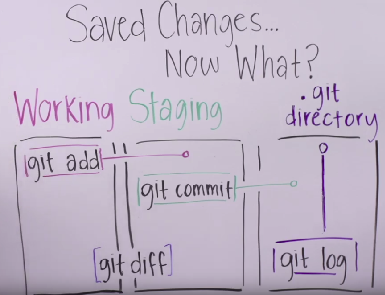
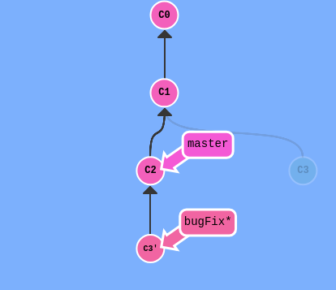

# Git
## Пометки
- clone - клонировать репозиторий на локальную машину
- git init - инициализировать репозиторий и начать отслеживать изменения
- git add - добавить файл в список тек изменение которых нужно отслеживать
- git commit - добавить изменения в локальный репозиторий
- 
- git status - посмотерть информацию
- git branch - посмотерть текущую ветку
- git branch newImage - создание новой ветки newBranch
- git checkout [name] - переключение на ветку
- git merge bugFix -  слияние bugFix в master ветку
- git pull - подтянуть себе изменения
- git push - обновить ветку удаленного репозитория
- rebase - копирует набор коммитов и переносит их в другое место
- git rebase master (получается, что старый коммит удаляется)
- 
- git rebase -i HEAD~4 - переставить несколько коммитов, или удалить какие-то через редактор
- HEAD - тот коммит с которым мы сейчас работаем
- git log - посмотеть журнал 
- git checkout master^ - перейти на родителя указанного коммита (передвинуть HEAD)
- git checkout HEAD~4 - перейти на 4 коммита выше
### branch forcing - перемещение ветки
- git branch -f master HEAD~3 - переместит ветку master на три родителя назад от HEAD
### отмена изменений
- git reset отменяет изменения, перенося ссылку на ветку назад, на более старый коммит. Это своего рода "переписывание истории"
- git reset перенесёт ветку назад, как будто некоторых коммитов вовсе и не было.
- git reset HEAD~1 - отменяет изменение перенося ссылку к предыдущим коммитам, как будто их и не было (только на локальных ветках)
- git revert - Чтобы отменить изменения и поделиться отменёнными изменениями с остальными 
- git revert HEAD - отменяет изменения (делает коммит противоположный последнему, можно сделать push и поделитья изменениями с остальными)
- git undo - 
### перемещение изменений
- git cherry-pick \<Commit1> \<Commit2> <...> - копировать несколько коммитов на место, где сейчас находишься (HEAD)
### перезапись истории
- git commit --amend - изменить коммит
- например чтобы добавить изменения в уже закоммиченный файл нужно
  - изменить файл
  - git add \<имя файла> - добавить его в список изменений
  - git commit --amend - добавить в предыдущий коммит
### теги
- git tag v1 c1 - создать тег v1 на коммит c1

- git describe - показывает, как далеко текущее состоянии от ближайшего тега
- git describe \<ref> - Где ref — это что-либо, что указывает на конкретный коммит. Если не указать ref, то git будет считать, что указано текущее положение (HEAD)
- git commit -m "[сообщение с описанием]" - коммит с сообщением
- commit --amend - ???
