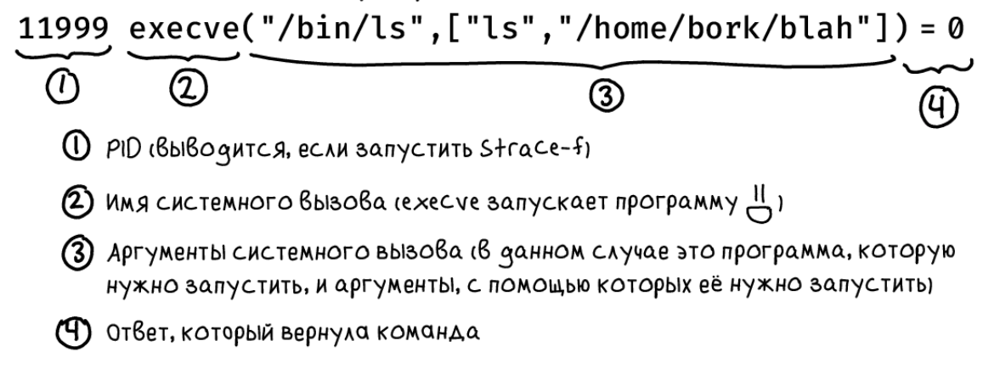

- <a href="https://help.ubuntu.ru/wiki/%D0%BA%D0%BE%D0%BC%D0%B0%D0%BD%D0%B4%D0%BD%D0%B0%D1%8F_%D1%81%D1%82%D1%80%D0%BE%D0%BA%D0%B0">справка</a>

- fuser 1099/tcp - проверка порта (какой процесс на нем)
- fuser -k 1099/tcp - убить процесс на порту
- ./main - запуск бинарного файла main

## Работа с файлами
- cp - копирвание файла. <code>cp \[options] source destination</code>
    - опции
    
     Опция | Значение
    ------------ | -------------
    -p | Сохраняет время модификации файла и максимально возможные полномочия. Без этой опции для нового файла задаются полномочия, соответствующие полномочиям запустившего команду пользователя
    -R или -r | Если source — каталог, то копируется как он, так и все входящие в него подкаталоги, т. е. сохраняется исходная форма дерева каталогов
    -d | Если задать эту опцию, то символические ссылки будут оставаться ссылками (а иначе вместо ссылки копируется файл, на который дается ссылка)
    -f | Перезаписывать файлы при копировании (если такие уже есть) без дополнительных предупреждений
    
- mkdir - создание папки
- \> имя_файла - оператор перенаправления. Можно таким обрахом создать файл
- \>> имя_файла - оператор перенаправления. Информация запишется в конец файла
- rm - delete folder   
- tree -d src/ - посмотреть дерево каталогов 
- tree -h src/ - посмотерть дерево каталогов в месте с файлами
- ls -la - посмотреть скрытые папки и доступы к файлам и папкам
- ls -lh - посмотреть файлы с подробной информацией
- cat имя_файла - вывести содержимое файла в консоль
- rename 's/.GIF/.gif/g' *.GIF - переименовать все файлы в папке. 
  - s=указывает, что требуется замещение.
  - /.sh/=Строка, которую будем замещать.
  - /.sh.bak/ = строка, на которую будем замещать
  - g=global, будем замещать все найденные вхождения.
    
- Shift + PageUp - terminal scrol up
- Shift + PageDown - terminal scrol down
- skype & - запуск программы в фоне
- ```sudo subl /etc/enviroment``` и прописать TOPJAVA_ROOT="/home/denis/projects/topjava" - добавить переменную окружения

## touch - утилита для работы с файлом
- touch файл.txt - создать файл
-  touch файл1 файл2 - создать несколько файлов сразу
- touch  -t 201601081830.14 файл - создать файл и установить ему заду создания. Формат даты YYMMDDHHMM.SS
- 

## CURL
- curl https://domain.ru - отобразить содержимое url
- curl -o website https://domain.ru - сохранить вывод в файл
- curl -O https://domain.ru/file.zip - скачать файл
- curl -o archive.zip https://domain.ru/file.zip - скачать в определенный файл
- curl -I http://domain.ru - получить заголовок

### убить процесс
- ps - посмотреть процессы
- ps -ef - посмотеть все процессы
- ps axu | grep -i 'idea' - найти PID процесса
- kill PID - убить процесс

- jps - посмотреть процессы java

- Запуск visualvm - visualvm --jdkhome '/home/denis/java/jdk1.8.0_181' --openpid process_id

- sudo update-alternatives --config java - выбрать версию java

### Заметки
- Esc + Fn - включить по умолчанию Fn кнопку

### strace (работа с системными вызовами)
- strace ls - посмотреть все
- 


- <a href="https://stackoverflow.com/questions/18740654/cannot-start-apache-tomcat-6-from-intellij-idea-12-1-4-ultimate-windows-7/38953356#38953356">Проверка кто занял порт</a>

## VIM
- vimtutor - посмотреть обучалку по vim

## SDK
- ```sdk use java <version>``` - изменение версии java