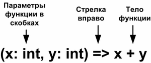

#### Теория
- Все операции в scala являются вызовами методов
- оператор cons - <code>::</code>
- если имя метода заканчивается двоеточием <code>:</code>, то метод вызывается у правого операнда (<code>a:::b</code> преобразуется в <code>b.:::(a)</code>)
- <code>Nil</code> - пустая коллекция (например для инициализации <code>List</code>)
- в отсутствии явного слова <code>return</code> метод в scala возвращает последнее вычисляемое им значение
- <b>процедура</b> - метод который выполняется только для получения побочного эффекта
- класс и объект спутники могут обращаться к закрытым элементам друг друга
- синглтон объект вызывается так: <b>имя синглтон-объекта точка имя метода</b> (как статический класс в Java)
- <b>автономный объект</b> - синглтон объект без спутника
- по умолчанию импортируется синглтон-объект <code>Predef</code>
- <code>import org.apache.http.{HttpEntity, HttpResponse}</code> - импорт нескольких классов из одного пакета
- <code>import org.apache.http._</code> - импорт всех классов пакета
- <code>import java.sql.{Date => SQLDate}</code> - импорт класса <code>Date</code> и присваивание ему нового имени (позволяет импортировать классы с одинаковыми именами)
- <b>сигнатура метода</b> - имя, список параметров и возвращаемый тип, если он указан.
- если метод не принимает параметров то его можно вызвать без скобок и точки
- функциональные объекты - те у которых нет изменяемого состояния
- в классе, если инструкция не принадлежит методу или полю, значит она принадлежит первичному конструктору
- функции – это конструкции первого класса
- параметризация - конфигурирование экземпляра в той точке программы, где он создается.
- параметризация типом и значением - <code>val greetStrings = new Array\[String\](3)</code>
- Когда вы применяете круглые скобки к переменной или значению и помещаете внутрь какие-то аргументы, Scala трансформирует их в вызов метода <code>apply</code>.
- когда присвоение выполняется для значения или переменной, за которой идут какие-то аргументы в скобках, компилятор трансформирует их в вызов метода <code>update</code>, принимающего два параметра. Например:
  <code>greetStrings(0) = "Hello"</code> трансформируется в <code>greetStrings.update(0, "Hello")</code>
- для создания нескольких конструкторов с перегруженными списками параметров необходимо назначить один из их первичным конструктором, и поместить параметры этого конструктора непосредственно за именем класса.
````scala
class RepeatGreeter(greeting: String, count: Int) 
{

  def this(greeting: String) = this(greeting, 1)

  def greet() = 
  {
    for (i <- 1 to count)
      println(greeting)
  }
}
````
- singleton-объекты создаются с помощью ключевого слова object
- singleton-объекты автоматически создаются при первом использовании
- Компилятор Scala трансформирует поля и методы singleton-объекта в статические поля и методы результирующего бинарного Java-класса.
- Скрипт же должен заканчиваться результирующим выражением.
- методы trait-ов Scala могут иметь реальные тела с реальным кодом. Вот пример:
````scala
trait Friendly 
{
  def greet() = "Hi"
}
````
- trait может расширять ноль или более trait-ов
- в Scala класс может расширять несколько trait-ов
- чтобы переопределить метод в Scala нужно перед def написать override
- в Scala вы можете смешивать trait-ы во время создания экземпляра
- def this() - определение дополнительного конструктора
- родительский конструктор может быть вызван только первичным конструктором
- тдентификаторы операторов - <code>+ ++ ::: <?> :-></code>
- подразумеваемое преобразование(пример) - <code>implicit def intToRational(x: Int) = new Rational(x)</code>
  метод преобразования из типа <code>Int</code> в тип <code>Rational</code>
- существует только одно значение с типом Unit, и оно записывается так - ()
- функция включенная в состав объекта - метод
- в scala можно определить локальную функцию (внутри другой функции), которые видны только в пределах своего блока
- локальные функции могут получять доступ к параметрам окружающей их функции
- функция первого класса - функция которая может быть передана в качестве аргумента, возвращена как результат из других функций, 
  присвоена переменным или сохранена в структуру данных
- функциональное значение - значение функционального литерала (объект класса functionN)
- функциональный литерал можно записать без типа - <code>(x) => x > 0</code>
- функциональный литерал можно записать без скобок - <code>x => x > 0</code>
- заместитель(<code>_</code>) - можно воспользоваться при условии, что каждый параметр появляесявнутри функционально литерала только один раз <code>someNumber.filter(\_ > 0)</code>
- знак подчеркивания можно рассмотреть как бланк, который следует заполнить (при каждом вызове)
- наличие нескольких знаков подчеркивания означает наличие нескольких параметров, а не однократное использование одного и того же
- знаком подчеркивания (<code>_</code>) можно заменить список параметров. <code>println _</code> интерпретируется как <code>x => println(x)</code>
- 

#### Типы данных

##### Unit
- Unit - аналог типа void в java
- Главная разница между <code>Unit</code> в Scala и <code>void</code> в Java состоит в том, что Scala позволяет записать значение типа <code>Unit</code>, а именно (), а в Java нет значений типа <code>void</code>.

#### Работа со строками
- строковая интерполяция - s"Hello $name!", если переменная name = "Denis", то получится строка "Hello Denis". Интерполятор s подставляет метод name.toString.
- можно сделать такую интерполяцию - s"Ответ равен ${6 * 7}"  и получится строка "Ответ равен 42"
- строковый интерполятор <b>raw</b> ведет себя практически также как и <b>s</b>, только не распознает управляющие последоватьности символьных литератлов
  например raw"No\\\\escape" выведет "No\\\\escape" а не "No\\escape"  
- строковый интерполятор <b>f</b> позволяет прикреплять к встроенным выражениям инструкции форматирования в стиле функции <code>printf</code> (синтаксис <code>java.util.Formatter</code>)
  например f"${Math.PI}%.5f" выведет "3.14159" (5 знаков после запятой)


#### Операторы (по факту методы)
- метод -> возвращает картеж (ключб значение)

#### Структуры данных

##### Кортеж (Tuples)
- структура данных которая объединяет несколько элементов (элементы могут быть разных типов)
- количество элементов - до 22 элементов, включительно
- создание: <code>val имя_коллекции = ("Some String", 100500, "#FFFFFF")</code>
- получение элемента: через <code>кортеж._№</code>, где № - номер элемента (начинается с 1)
- получение элемента: <code>val integerTupleSum = integerTuple._1 + integerTuple._2 + integerTuple._3</code>

##### Массив (Array)
- создание массива - <code>val greetStrings = new Array\[String\](3)</code>
- инициализация массива - <code>greetStrings(0) = "Hello"</code>
- доступ к элементу массива - <code>greetStrings(0)</code>

##### List
- имутабилен (не изменен)
- создание листа - <code>val oneTwoThree = List(1, 2, 3)</code>
- <code>:::</code> - метод конкатенирует переданный список и список, для которого был вызван <code>:::</code>
- пример:
````scala
val oneTwo = List(1, 2)
val threeFour = List(3, 4)
val oneTwoThreeFour = oneTwo ::: threeFour
````
- <code>::</code> - присоединяет новый элемент к началу существующего списка и возвращает получившийся лист
- инициализация List - val oneTwoThree = 1 :: 2 :: 3 :: Nil
- некоторые методы

First Header | Second Header
------------ | -------------
List() | создает пустой список
List("Cool", "tools", "rule") | Создает новый List\[String\] с тремя значениями "Cool", "tools" и "rule"
val thrill = "Will" :: "fill" :: "until" :: Nil | Создает новый List\[String\] с тремя значениями "Will", "fill" и "until"
thrill(2) | Возвращает второй (с отсчетом с нуля) элемент списка thrill (возвращает "until").
thrill.count(s => s.length == 4) | Возвращает число элементов thrill, длина которых равна 4 (возвращает 2).
thrill.drop(2) | Возвращает список thrill без первых двух элементов (возвращает List("until")).
thrill.dropRight(2) | Возвращает список thrill без двух правых элементов (возвращает List("Will ")).
thrill.exists(s => s == "until") | Определяет, есть ли в thrill элемент со значением "until" (возвращает true).
thrill.filter(s => s.length == 4) | Возвращает список, состоящий из элементов списка thrill List , длина которых равна 4 (возвращает List("Will", "fill"))
thrill.forall(s => s.endsWith("l")) | Возвращает true, если все ли элементы списка thrill заканчиваются на букву "l", и false в обратном случае (в данном примере возвращает true).
thrill.foreach(s => print(s)) | Исполняет выражение print для каждого элемента списка thrill (выводит "Willfilluntil").
thrill.foreach(print) | То же, что предыдущее, но короче (тоже выводит "Willfilluntil").
thrill.head | Возвращает первый элемент списка thrill (возвращает "Will").
thrill.init | Возвращает список, состоящий из всех, кроме последнего, элементов списка thrill (возвращает List("Will", "fill")).
thrill.isEmpty | Отвечает на вопрос, является ли список thrill пустым (возвращает false)
thrill.last | Возвращает последний элемент списка thrill ("until")
thrill.length | Возвращает число элементов списка thrill (возвращает 3).
thrill.map(s => s + "y") | Возвращает список, образующийся при добавлении "y" к каждому из элементов списка thrill. То есть как бы отображает (map) один список на другой (возвращает List("Willy", "filly", "untily")).
thrill.remove(s => s.length == 4) | Возвращает копию списка thrill, из которой удалены все элементы, длина которых равна 4 (возвращает List("until")).
thrill.reverse | Возвращает List, содержащий все элементы thrill List в обратном порядке (возвращает List("fill", "until", "Will")).
thrill.sort((s, t) => s.charAt(0).toLowerCase < t.charAt(0).toLowerCase) | Возвращает отсортированную копию списка thrill (возвращает List("fill", "until", "Will")).
thrill.tail | Возвращает список thrill за вычетом его первого элемента (возвращает List("fill", "until")).

- обхож элементов массива - <code>for(file <- files)</code>
- можно перебрать коллекцию с применением фильтров 
    ````scala
    for(
        file <- filesHere
        if file.isfile
        if file.getNmae.endsWith(".scala")
        ) println(file)
    ````

##### Map
- создание Map - <code>val treasureMap = new HashMap\[Int, String]</code> (создается новый экземпляр изменяемого HashMap, с ключами типа Int и значениями типа String, и и помещает ссылку на HashMap в значение treasureMap)
- добавление элемента - <code>treasureMap += 1 -> "Go to island."</code> (компилятор Scala трансформирует выражение бинарной операции типа 1 -> "Go to island." в 1.->("Go to island.").
  То есть, когда вы говорите 1 -> "Go to island.", вы в действительности вызываете метод -> для Int со значением 1, и передаете ему String со значением "Go to island." Этот метод ->, 
  который вы можете вызвать для любого объекта Scala-программы, возвращает кортеж из двух элементов, содержащий ключ и значение. Затем этот кортеж вы передаете методу += объекту HashMap, на который ссылается treasureMap.)
- получение элемента - <code>treasureMap(2)</code>
- создание с помощью фабричного метода - <code>val romanNumeral = Map(1 -> "I", 2 -> "II", 3 -> "III", 4 -> "IV", 5 -> "V")</code>
- 


#### Рекомендации по стилю
- Если метод может иметь побочные эффекты (говорят, что метод имеет побочный эффект, если он изменяет состояние 
  за пределами метода), скобки нужно указывать независимо от того, требует ли их компилятор.
- консттанты принято называть так - Take, XOfset

#### Predef
- require(par: Boolean) - метод для проверки значений. Если приходит false, то будет выброшен <code>java.lang.IllegalArgumentException</code>


#### Функциональное программирование
- foreach - <code>args.foreach(arg => println(arg))</code> (для args вызывается метод foreach, которому передается функция). В данном случае вы передаете анонимную функцию (не имеющую имени), принимающую один параметр arg. Код анонимной функции – <code>println(arg)</code>.
- эквивалент предыдущей функции - <code>args.foreach(println)</code> или <code>args.foreach(arg: String => println(arg))</code>
- 
- for comprehension - <code>for (arg <- args) println(arg)</code>. Слева от символа <code><-</code>, который можно назвать "в",
  находится декларация нового значения (не переменной) <code>arg</code>. Справа от <code><-</code> находится знакомый массив <code>args</code>.
  При выполнении этого кода значение arg будет сопоставлено по очереди с каждым элементом массива <code>args</code>, и для каждого значения 
  будет выполнено тело <code>for</code>, <code>println(arg)</code>.
- for comprehension - <code>for (i <- 0 to 2) print(greetStrings(i))</code>. <code>to</code> на самом деле метод, определенный в классе <code>scala.Int</code>, и принимающий один аргумент, также типа <code>int</code>. Код <code>0 to 2</code> трансформируется в вызов метода <code>0.to(2)</code>
- 

#### Встроенные структуры управления
- структура управления - match ???
- выражение if возвращает значение <code>val filename = if (!args.isEmpty) args(0) else "default.txt"</code>
- <code>for условие yield тело</code> - перебор элеменов с помещением в новую коллекцию
````scala
val forLine = 
    for {
        file <- files
        if file.getName.endsWith(".scala")
    } yield file.lenght
````
- 

#### Обработка исключений
- <code>trow new IllegalArgumentException</code> - кинуть новое исключение
- у исключения есть тип возвращаемого результата
- выданное исключение относиться к типу <b>Nothing</b>
````scala
  try {
    val f = new FileReader("input.txt")
    // Use and close file
  } catch {
    case ex: FileNotFoundException => // Handle missing file
    new URL("http://vc.com") //можно вернуть значение !!!
    case ex: IOException => // Handle other I/O error
  }
````
- при обработке исключений по очереди предпринимается попытка выполнения <code>case</code>
- scala не требут перехвата проверяемых исключений
- общая схема - <code>try t() cath{case e: Exception => ...} finally f()</code>

#### Паттерн матчинг
- аналогично инструкции <code>switch</code> в других языках
- пример:
````scala
val firstArg = if (!args.isEmpty) args(0) else ""
val friend =
  firstArg match {
    case "salt" => "pepper"
    case "chips" => "salsa"
    case "eggs" => "bacon"
    case "hello" => 102
    case _ => "huh?"
  }
println(friend)
````
- значение <code>_</code> - используется как значение по умолчанию
- в case могут использоваться любые типы
- pattern match - возвращает значение !!!

#### Частично применяемые функции
- частично применяемая функция является выражением, в котором не содержаться все аргументы, необходимые функции. Вместо этого есть некоторые из них или вообще отсутствуют аргументы
- пример - <code>val a = sum _</code>, <code>def sum(a: Int, b: Int, c: Int) = a + b + c</code>
- объект функционального значения - экземпляр класса,  ДОПИСАТЬ ОПРЕДЕЛЕНИЕ !!!
- знак подчеркивания - способ преобразования def в функциональное значение (завернуть метод в функциональное значение)
- частично применяемую функцию можно выразить предоставив ей только некоторые аргументы - <code>val b = sum(1, _: Int, 3)</code>, обратиться можно <code>b(2)</code>
- 

#### Замыкания
- <code>(x: Int) => x + 1</code> - замкнутый терм
- Замыкание (открытый терм) - функциональный литерал со свободными переменными - <code>(x: Int) => x + more</code>
- функция использующая замыкание - <code>def makeInc(more: Int) = (x: Int) => x + more</code> - замыкание замыкается на переменной more функции
- создание замыкания - <code>val inc1 = makeInc(1) - создасться замыкание захватывающее в качестве more число 1
- 
