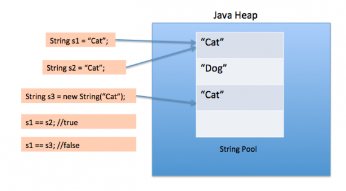

Имеется такой код:
````java
public class Main {
    public static void main(String[] args) {
        String s;
        s = "hello";

        System.out.println(s == "hello"); //1
        System.out.println(s.equals("hello")); //2
        System.out.println("hello".equals(s)); //3
        
        //4
        String s1 = "a" + "bc";
        String t1 = "ab" + "c";
        System.out.println(s1 == t1);
    }
}
````
1. Что вывидется на экран?
2. Как работает код в данных случаях?
3. Какой вариант сравнения лучше выбрать?
4. Что будет в этом случае?

Ответы:
1. На экран выведется :
````code
true
true
true
````

2. При созданни строки через строковый литерал в Java Heap создается объект String и помещается в пулл строк.
Диаграмма ниже объясняет как работает пулл строк

Пул строк возможен исключительно благодаря неизменяемости строк в Java и реализации идеи интернирования строк. Пул строк также является примером паттерна Приспособленец (Flyweight).

Пул строк помогает экономить большой объем памяти, но с другой стороны создание строки занимает больше времени Когда мы используем двойные кавычки для создания строки, сначала ищется строка в пуле с таким же значением, если находится, то просто возвращается ссылка, иначе создается новая строка в пуле, а затем возвращается ссылка.

Тем не менее, когда мы используем оператор new, мы принуждаем класс String создать новый объект строки, а затем мы можем использовать метод intern() для того, чтобы поместить строку в пул, или получить из пула ссылку на другой объект String с таким же значением.

Ответ 3.

- В первом варианте сравниваются ссылки на объекты
- Во втором варианте мы можем поймать <code>java.lang.NullPointerException</code>, усли переменной <code>s</code> не присвоена ссылка на объект <code>String</code>
- В третьем случае <code>java.lang.NullPointerException</code> быть не может, т.к. метот <code>equals</code> дергаем у инстанса. Если переменная <code>s</code> будет ссылаться на <code>null</code>, то будет выведено <code>false</code> (<code>null instanceof String</code> возвращает <code>false</code>)
Метод <code>equals</code> класса <code>String</code>
````java
    public boolean equals(Object anObject) {
        if (this == anObject) {
            return true;
        }
        if (anObject instanceof String) {
            String anotherString = (String)anObject;
            int n = value.length;
            if (n == anotherString.value.length) {
                char v1[] = value;
                char v2[] = anotherString.value;
                int i = 0;
                while (n-- != 0) {
                    if (v1[i] != v2[i])
                        return false;
                    i++;
                }
                return true;
            }
        }
        return false;
    }
````

4. Выведет <code>true</code>
- Когда компилятор оптимизирует ваши строковые литералы, он видит, что оба s1 и t1 имеют одинаковое значение и, следовательно, вам нужен только один строковый объект.
  В результате оба s1 и t1 указывают на один и тот же объект.